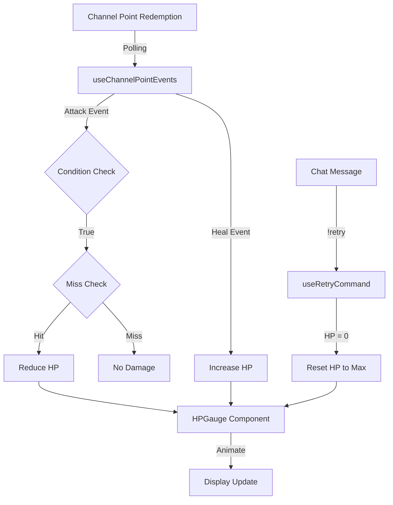

# OBS Overlay HP Gauge System 仕様書

## 概要

OBSブラウザソースとして使用するヒットポイントゲージオーバーレイシステム。Twitchチャンネルポイント引き換えイベントと連動し、視聴者の攻撃/回復アクションを反映したHPゲージを表示します。

## 機能要件

### 1. ヒットポイントゲージ表示

#### 1.1 基本仕様

- **表示形式**: 横方向（左から右に減少）
- **最大HP表示**: パーセンテージではなく数値で表示（例: "100/100"）
- **ゲージの重ね合わせ**: 複数のゲージを重ねて表示
- **重ねるゲージ数**: 設定可能（デフォルト: 3）

#### 1.2 ゲージの色設定

- **1番目（最前面/最後のゲージ）**: 赤色（#FF0000）
- **2番目**: オレンジ色（#FFA500）
- **3番目以降**: 緑色（#00FF00）と水色（#00FFFF）を交互に使用

#### 1.3 アニメーション

- **減少アニメーション**: イージング関数を使用（ease-out推奨）
- **アニメーション時間**: 設定可能（デフォルト: 0.5秒）
- **イージング関数**: cubic-bezier(0.4, 0, 0.2, 1) または ease-out

### 2. チャンネルポイントイベント連動

#### 2.1 攻撃イベント

- **イベント取得**: ポーリング方式でチャンネルポイント引き換えを監視
- **条件判定**: シンプルな条件設定（リワードID、ユーザー名など）
- **ミス判定**: 有効/無効を設定可能
- **ミス確率**: 0-100%で設定可能（ミス判定が有効な場合）
- **ダメージ量**: 設定可能（固定値）

#### 2.2 回復イベント

- **イベント取得**: ポーリング方式でチャンネルポイント引き換えを監視
- **回復量**: 設定可能
- **回復量タイプ**:
  - 固定値
  - ランダム（最小値～最大値の範囲）

### 3. リトライ/復活機能

#### 3.1 リトライコマンド

- **コマンド**: `!retry`
- **実行条件**: HPが0になった時のみ有効
- **効果**: HPを最大値に回復
- **監視方法**: Twitchチャットメッセージを監視（既存のuseTwitchChatを使用）

### 4. 設定管理

#### 4.1 設定ファイル

- **形式**: JSON
- **保存場所**: `public/config/overlay-config.json`
- **設定項目**:
  ```json
  {
    "hp": {
      "max": 100,
      "current": 100,
      "gaugeCount": 3
    },
    "attack": {
      "rewardId": "",
      "enabled": true,
      "damage": 10,
      "missEnabled": false,
      "missProbability": 0
    },
    "heal": {
      "rewardId": "",
      "enabled": true,
      "healType": "fixed",
      "healAmount": 20,
      "healMin": 10,
      "healMax": 30
    },
    "retry": {
      "command": "!retry",
      "enabled": true
    },
    "animation": {
      "duration": 500,
      "easing": "ease-out"
    },
    "display": {
      "showMaxHp": true,
      "fontSize": 24
    }
  }
  ```


#### 4.2 設定UI

- **場所**: メインアプリ（`/`）に設定ページを追加
- **機能**: 設定ファイルの編集、プレビュー、保存

## 技術実装

### 1. ルーティング

- **オーバーレイ表示**: `/overlay` ルート
- **設定ページ**: `/settings` ルート（オプション）
- React Routerを使用して実装

### 2. コンポーネント構成

```
src/
├── components/
│   ├── overlay/
│   │   ├── HPGauge.tsx          # HPゲージコンポーネント
│   │   ├── HPGaugeLayer.tsx     # 個別のゲージレイヤー
│   │   └── HPDisplay.tsx         # HP数値表示
│   └── settings/
│       └── OverlaySettings.tsx  # 設定UIコンポーネント
├── hooks/
│   ├── useHPGauge.ts            # HPゲージ状態管理
│   ├── useChannelPointEvents.ts # チャンネルポイントイベント監視
│   └── useRetryCommand.ts       # リトライコマンド監視
├── utils/
│   ├── overlayConfig.ts         # 設定ファイル読み込み/保存
│   └── animation.ts              # アニメーション関数
└── types/
    └── overlay.ts                # オーバーレイ関連の型定義
```

### 3. データフロー



### 4. 実装の詳細

#### 4.1 HPゲージコンポーネント

- CSS GridまたはFlexboxで重ね合わせ
- `transform: scaleX()` または `width` でアニメーション
- CSS transitionsでイージング実装

#### 4.2 チャンネルポイントイベント監視

- `useTwitchChannelPointRedemptions` を拡張
- ポーリング間隔: 5-10秒（設定可能）
- 新しい引き換えを検出したら処理

#### 4.3 設定ファイル管理

- `fetch` でJSONファイルを読み込み
- 設定変更時はファイルに書き込み（開発環境のみ、本番は別方法検討）

## 実装手順

1. **型定義と設定管理の実装**

   - `src/types/overlay.ts` 作成
   - `src/utils/overlayConfig.ts` 作成

2. **HPゲージコンポーネントの実装**

   - `src/components/overlay/HPGauge.tsx` 作成
   - 重ね合わせとアニメーション実装

3. **イベント監視フックの実装**

   - `src/hooks/useChannelPointEvents.ts` 作成
   - `src/hooks/useRetryCommand.ts` 作成

4. **オーバーレイページの実装**

   - React Router設定
   - `/overlay` ルート作成

5. **設定UIの実装**（オプション）

   - 設定ファイル編集UI

## 注意事項

- OBSブラウザソースでは透明背景が必要（CSS: `background: transparent`）
- ポーリング頻度はTwitch APIのレート制限に注意
- 設定ファイルの書き込みは開発環境のみ（本番は別の方法を検討）
- OAuth認証が必要（チャンネルポイント情報取得のため）